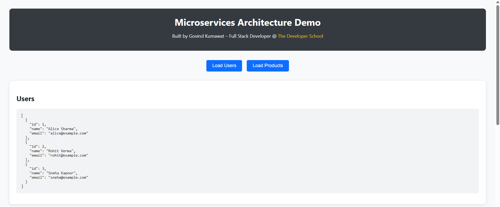
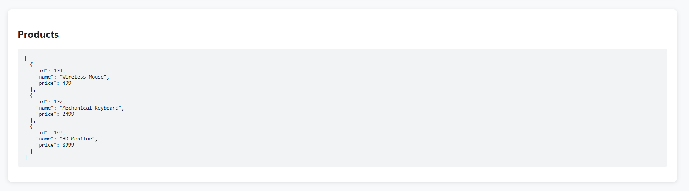
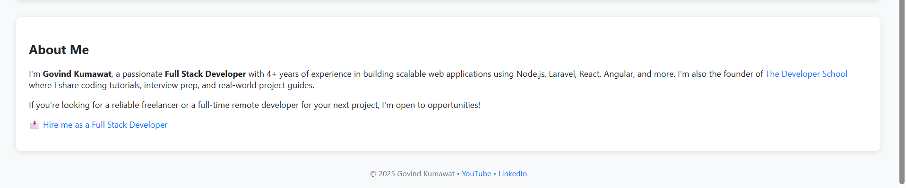
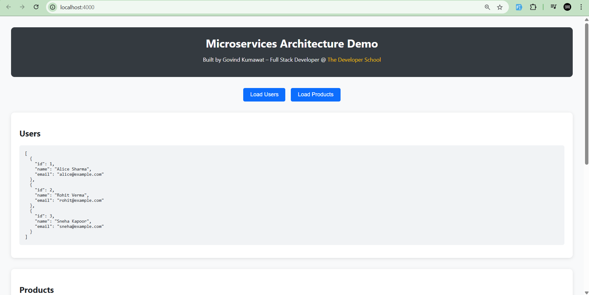
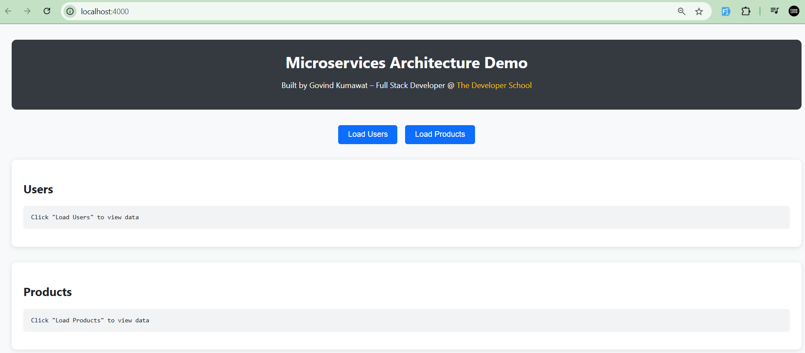
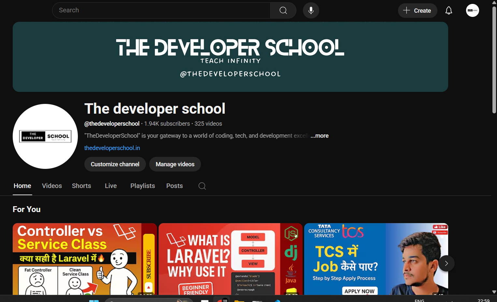
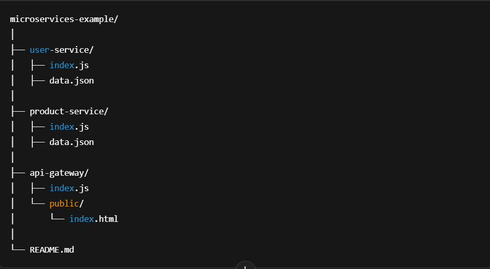

# 🧩 Microservices Demo – Built by Govind Kumawat

This project demonstrates a simple microservices architecture using **Node.js and Express**, featuring:

- **User Service**
- **Product Service**
- **API Gateway**
- **Frontend page** to fetch and display data

> Built with ❤️ by [Govind Kumawat](https://thedeveloperschool.in) – Full Stack Developer, Founder of The Developer School.

---

## 🌐 Live Demo

**Coming soon** (You can deploy it easily to platforms like [Render](https://render.com), [Railway](https://railway.app), or [Vercel](https://vercel.com)).

---

## 📸 Screenshots

### 🔽 Home Page with Microservice Buttons

> You can place your screenshots inside a folder called `images/` in the root and name them accordingly.

---

## 🚀 Tech Stack

- Node.js
- Express.js
- HTML/CSS (vanilla frontend)
- REST APIs
- JSON for data storage (no DB for simplicity)

---

## 🛠️ Getting Started

### 1. Clone the repo

git clone https://github.com/your-username/microservices-example.git
cd microservices-example

### node user-service/index.js
### node product-service/index.js
### node api-gateway/index.js
